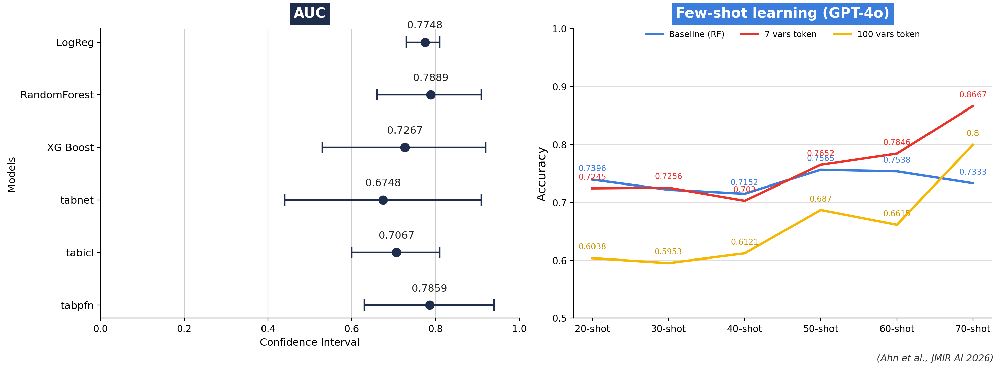

# ML4Mindfulness_Autism

# AI Prediction of Individual Treatment Response to Smartphone Mindfulness in Autistic Adults
**Predicting responders vs. non-responders to a smartphone-based mindfulness intervention from baseline questionnaires — comparing six machine learning models with GPT-4o few-shot learning.**

This repository accompanies the manuscript:

> **Artificial Intelligence Prediction of Individual Treatment Response to Smartphone-Based Mindfulness in Autistic Adults with Anxiety Symptoms: A Randomized Controlled Trial Analysis**
> Gun Ahn, Cindy Li, Aixin Liang, Wonchang Choi, Seoin Ahn, Clark Roberts, John D. E. Gabrieli
> *JMIR AI* (2026)

We perform a **secondary analysis** of a randomized controlled trial (RCT) showing that a 6-week, smartphone-based mindfulness program reduced anxiety in autistic adults. Here we ask: *Can baseline self-report measures predict who benefits most?* We benchmark six machine learning models with **nested cross-validation**, interpret which baseline characteristics distinguish responders from non-responders, and evaluate **GPT-4o few-shot learning** as a complementary approach for low-data clinical prediction.

---

## Results



*Left: cross-validated AUC (with 95% CIs) for the six models predicting state-anxiety response. Right: GPT-4o few-shot accuracy at 20–70 shots against a Random Forest baseline, using 7-feature vs. 100-feature tokenization. Figure regenerated from the reported values — see `figures/make_figure.py`.*

---

## TL;DR (Key Findings)
- **Outcome**: Responder = **≥7-point decrease on STAI-State** (post vs. pre), reflecting a clinically meaningful shift.
- **Sample**: 73 participants who completed the intervention.
- **Best model**: **Random Forest**, AUC **0.79** (95% CI 0.66–0.91), followed by **TabPFN** (0.78, 0.64–0.94) and **logistic regression** (0.77, 0.73–0.81).
- **Who benefits**: Higher **baseline state anxiety** (β = 1.20, *P* < .001) predicted **better** response; higher **Autism Quotient** (β = −0.17, *P* = .001), **older age** (β = −0.18, *P* = .02), and **lower childhood pretend-play** scores (β = −0.93, *P* = .007) predicted **poorer** response.
- **Few-shot LLM**: GPT-4o with **compact 7-feature tokenization** reached **0.867 accuracy at 70 shots** — exceeding Random Forest (0.733) — while 100-feature tokenization underperformed, showing the value of high-signal, low-dimensional inputs.
- **Trait vs. state**: Prediction of **trait**-anxiety change was much weaker (AUCs 0.46–0.68), consistent with the stability of this personality dimension.

---

## Methods
- **Design**: Secondary analysis of an RCT comparing a 6-week smartphone-based mindfulness intervention with a waitlist control in autistic adults.
- **Predictors**: Baseline demographics, autism-trait measures, and self-report questionnaires assessing anxiety symptoms, perceived stress, affect, and mindfulness.
- **Validation**: **Nested 10-fold cross-validation** with an **inner 5-fold** loop for hyperparameter tuning.
- **Models**: Logistic Regression, Random Forest, XGBoost, TabNet, Tab-ICL, and TabPFN.
- **Few-shot learning**: **GPT-4o** with tokenized features evaluated at **20–70 shots**, comparing a compact **7-feature** representation against a **100-feature** representation.
- **Interpretation**: Feature-importance and coefficient analyses identify the baseline characteristics separating responders from non-responders.

---

## Repository Structure
```
ML4Mindfulness_Autism/
├── RandomForest.ipynb        # Random Forest analysis notebook
├── XGBoost.ipynb             # XGBoost analysis notebook
├── figures/
│   ├── model_results.png     # Results figure (AUC + few-shot curves)
│   └── make_figure.py        # Script to regenerate the figure
└── won/
    ├── classification/       # Classification model code
    │   ├── main.py
    │   └── utils.py
    └── pai/                  # Personalized Advantage Index utilities
        ├── data_load.py
        ├── preprocessing.py
        ├── training.py
        ├── whole_train.py
        ├── display.py
        └── utils.py
```

---

## Reproducing the Figure
```bash
pip install matplotlib numpy
python figures/make_figure.py   # writes figures/model_results.png
```

---

## Citation
```bibtex
@article{ahn2026aimindfulness,
  title   = {Artificial Intelligence Prediction of Individual Treatment Response to
             Smartphone-Based Mindfulness in Autistic Adults with Anxiety Symptoms:
             A Randomized Controlled Trial Analysis},
  author  = {Ahn, Gun and Li, Cindy and Liang, Aixin and Choi, Wonchang and
             Ahn, Seoin and Roberts, Clark and Gabrieli, John D. E.},
  journal = {JMIR AI},
  year    = {2026}
}
```

---

## Clinical Takeaway
Machine learning identified baseline characteristics predicting **state-anxiety response** to a smartphone-based mindfulness intervention in autistic adults. Few-shot learning with LLMs matched or exceeded traditional models when given compact, high-signal feature representations — a promising direction for clinical prediction in small-sample settings. As online mental-health interventions become ubiquitous, patients and clinicians can better anticipate whether a given intervention is likely to help an individual.
